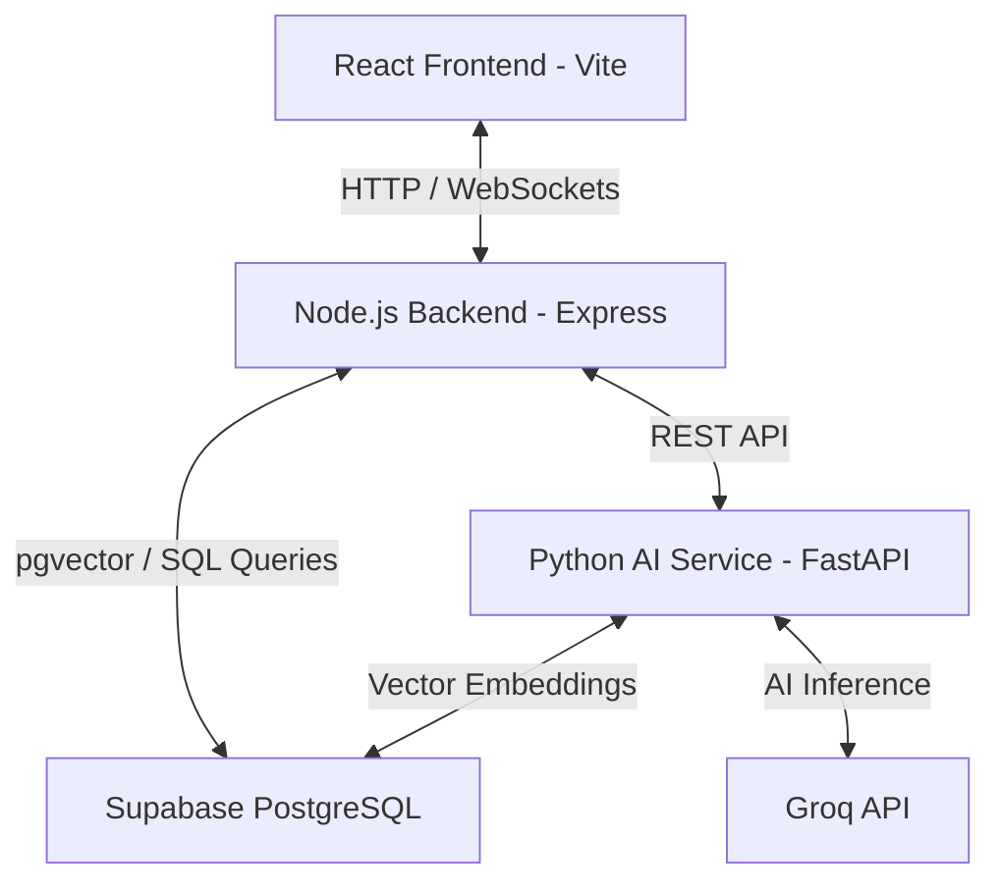

# SAFIRA: Automated HIRAC Report Generator
## Technical System Design & Architecture Document

This document outlines the architecture, database schema, mathematical strategy, RAG (Retrieval-Augmented Generation) pipeline, and frontend design guidelines for the SAFIRA HIRAC (Hazard Identification, Risk Assessment & Control) web application.

---

## 1. System Architecture

SAFIRA is designed as a three-tier web application, optimized for rapid AI inference and robust mathematical calculations:



### Components
1. **Frontend (React + Vite)**: 
   - An interactive, spreadsheet-like interface styled to match official airport hazard report standards.
   - Implements inline cell editing, dropdowns for risk parameters, and automatic color-coded index updates.
   - Integrates a side-by-side RAG chatbot panel that enables conversational edits and report regeneration.
2. **Backend (Node.js + Express)**:
   - Serves as the API Gateway.
   - Handles authentication, session management, and CRUD operations for reports via Supabase.
   - Orchestrates report workflows and communicates with the Python AI Service.
3. **Python AI Service (FastAPI)**:
   - Manages the NLP and RAG pipelines.
   - Handles PDF parsing of airport manuals and SOPs, converting them into vector embeddings stored in Supabase.
   - Performs mathematical validations of risk calculations (using structured NumPy/Pandas checks if needed).
   - Queries the **Groq API** (using models like Llama-3-70b) to generate the initial HIRAC table rows and power the RAG chatbot.
4. **Database (Supabase PostgreSQL + pgvector)**:
   - Stores report metadata, table rows, and chat history.
   - Stores chunked safety manuals and their vector embeddings for semantic document search.

---

## 2. Mathematical Risk Strategy & Lookup Matrix

Risk assessment in aviation safety follows standard safety management system (SMS) principles, typically defined by the **International Civil Aviation Organization (ICAO)** or local aviation authorities.

### Risk formula
$$\text{Risk Score (R)} = \text{Likelihood (L)} \times \text{Severity (S)}$$

### 1. Likelihood Scale (1 to 5)
* **5 (Almost Certain / Frequent)**: Likely to occur many times (has occurred frequently).
* **4 (Likely / Occasional)**: Likely to occur sometimes (has occurred infrequently).
* **3 (Possible / Remote)**: Unlikely to occur, but possible (has occurred rarely).
* **2 (Unlikely / Improbable)**: Very unlikely to occur (not known to have occurred).
* **1 (Rare / Extremely Improbable)**: Almost inconceivable that it will occur.

### 2. Severity Scale (1 to 5)
* **5 (Catastrophic)**: Equipment destruction, multiple fatalities.
* **4 (Major)**: Serious injury, major equipment damage.
* **3 (Moderate)**: Minor injury, minor equipment damage.
* **2 (Minor)**: Nuisance, operating limitations, use of emergency procedures.
* **1 (Insignificant)**: Little or no consequences.

### 3. Risk Index Grid (Safety Risk Assessment Matrix)

| Likelihood \ Severity | 1 (Insignificant) | 2 (Minor) | 3 (Moderate) | 4 (Major) | 5 (Catastrophic) |
|---|---|---|---|---|---|
| **5 (Almost Certain)** | 5 (Medium) | 10 (Medium) | 15 (High) | 20 (High) | 25 (High) |
| **4 (Likely)** | 4 (Low) | 8 (Medium) | 12 (Medium) | 16 (High) | 20 (High) |
| **3 (Possible)** | 3 (Low) | 6 (Medium) | 9 (Medium) | 12 (Medium) | 15 (High) |
| **2 (Unlikely)** | 2 (Low) | 4 (Low) | 6 (Medium) | 8 (Medium) | 10 (Medium) |
| **1 (Rare)** | 1 (Low) | 2 (Low) | 3 (Low) | 4 (Low) | 5 (Medium) |

### 4. Classification & Color Coding
* **Score 1 - 4**: **Low Risk (Green)** - Acceptable without further action.
* **Score 5 - 12**: **Medium Risk (Yellow)** - Tolerable; requires mitigating actions to keep risk As Low As Reasonably Practicable (ALARP).
* **Score 15 - 25**: **High Risk (Red)** - Intolerable; operations must cease until immediate mitigating actions reduce risk.

*Note: The system will calculate both the **Initial Safety Risk Index** (before controls) and the **Residual Risk Index** (after mitigating actions are applied).*

---

## 3. Database Schema Design (Supabase PostgreSQL)

```sql
-- Enable pgvector extension for RAG embeddings
CREATE EXTENSION IF NOT EXISTS vector;

-- 1. Reports Metadata Table
CREATE TABLE hirac_reports (
    id UUID PRIMARY KEY DEFAULT gen_random_uuid(),
    title VARCHAR(255) NOT NULL,
    ref_no VARCHAR(100) UNIQUE NOT NULL,
    department VARCHAR(100),
    location VARCHAR(255) NOT NULL,
    activity_assessed VARCHAR(255) NOT NULL,
    date_created DATE NOT NULL DEFAULT CURRENT_DATE,
    date_reviewed DATE,
    assessor_team TEXT NOT NULL,
    prepared_by_name VARCHAR(100),
    prepared_by_role VARCHAR(100),
    approved_by_name VARCHAR(100),
    approved_by_role VARCHAR(100),
    acknowledged_by_name VARCHAR(100),
    acknowledged_by_role VARCHAR(100),
    footer_remarks TEXT,
    created_at TIMESTAMP WITH TIME ZONE DEFAULT TIMEZONE('utc'::text, NOW()) NOT NULL
);

-- 2. Report Rows (The actual table lines)
CREATE TABLE hirac_rows (
    id UUID PRIMARY KEY DEFAULT gen_random_uuid(),
    report_id UUID REFERENCES hirac_reports(id) ON DELETE CASCADE,
    row_order INT NOT NULL,
    operation_type TEXT NOT NULL, -- e.g., 'Passenger terminal operations'
    generic_hazard TEXT NOT NULL,
    risks TEXT NOT NULL,
    existing_defenses TEXT NOT NULL,
    initial_likelihood INT NOT NULL CHECK (initial_likelihood BETWEEN 1 AND 5),
    initial_severity INT NOT NULL CHECK (initial_severity BETWEEN 1 AND 5),
    initial_risk_score INT NOT NULL, -- calculated: L * S
    initial_risk_index VARCHAR(10) NOT NULL, -- 'Low', 'Medium', 'High'
    mitigating_actions TEXT NOT NULL,
    residual_likelihood INT NOT NULL CHECK (residual_likelihood BETWEEN 1 AND 5),
    residual_severity INT NOT NULL CHECK (residual_severity BETWEEN 1 AND 5),
    residual_risk_score INT NOT NULL, -- calculated: L * S
    residual_risk_index VARCHAR(10) NOT NULL, -- 'Low', 'Medium', 'High'
    remarks TEXT,
    target_date DATE,
    department_responsible VARCHAR(150),
    created_at TIMESTAMP WITH TIME ZONE DEFAULT TIMEZONE('utc'::text, NOW()) NOT NULL
);

-- 3. Document Chunks Table (For RAG vector search)
CREATE TABLE safety_documents (
    id UUID PRIMARY KEY DEFAULT gen_random_uuid(),
    document_name VARCHAR(255) NOT NULL,
    content TEXT NOT NULL,
    embedding VECTOR(1536), -- Vector dimensions for standard embeddings (e.g., OpenAI/Cohere/HuggingFace)
    metadata JSONB,
    created_at TIMESTAMP WITH TIME ZONE DEFAULT TIMEZONE('utc'::text, NOW()) NOT NULL
);

-- Index for fast vector similarity search
CREATE INDEX ON safety_documents USING ivfflat (embedding vector_cosine_ops) WITH (lists = 100);
```

---

## 4. AI & NLP RAG Pipeline (Python + Groq)

### Step 1: Initial Report Generation
1. **User Prompt**: The user enters a brief prompt (e.g., *"Generate a HIRAC report for a typhoon scenario affecting passenger terminal operations and aircraft ground handling at MCIA Airport"*).
2. **Groq Prompt Engineering**:
   - The Python service parses the prompt and queries the vector store to fetch relevant guidelines for "typhoon airport operations".
   - The service constructs a system prompt with few-shot examples that instructs Groq (e.g. `llama3-70b-8192`) to return a structured **JSON** array mapping exactly to the columns of the `hirac_rows` table.
   - It enforces JSON-mode output to ensure the response can be directly parsed.

### Step 2: RAG Chatbot Integration
1. **Chat Interaction**: On the sidebar, the user can type questions or directives:
   - *Example 1*: "Why did you classify the earthquake risk as Medium?"
   - *Example 2*: "Add a row for bird strike hazards under aircraft operations."
   - *Example 3*: "Change the mitigating action of row 2 to align with FAA ground handling procedures."
2. **Agentic Actions**:
   - The chatbot is powered by a RAG agent. It searches the vector database for relevant safety codes.
   - If the request is query-only, the agent replies with explanations.
   - If the request is edit-only (e.g., "Change the target date of row 1 to next month"), the chatbot translates the instruction into a structured delta payload, updates the state in the database, and syncs the UI in real-time.

---

## 5. UI/UX Design & High-Fidelity PDF Export

### Interface Styling (Rich Aesthetics)
- **Visuals**: A clean, premium dashboard layout. A dark-themed app container with a light-themed, high-contrast document canvas in the center to mimic a physical sheet of paper.
- **Micro-Animations**: Hover animations on action buttons, sliding sidebar transitions, and pulsing indicator colors (red, yellow, green) for risk levels.
- **Spreadsheet Features**:
  - The tables are fully editable. Cells contain `contenteditable` divs or borderless input fields.
  - Risk matrix fields ($L$ and $S$) are formatted as inline dropdowns. Changing them automatically triggers a recalculation of the Risk Index and transitions the cell's background color dynamically (Green $\rightarrow$ Yellow $\rightarrow$ Red).

### High-Fidelity PDF Export
- **Aviation safety reports** require specific formatting for audit trails.
- **Strategy**: We will implement a specialized CSS printable stylesheet utilizing `@media print` rules, combined with a library like **Puppeteer** on the backend. This produces a pixel-perfect export of the HTML container matching the header, table, and signature sections seen in the attached screenshots, bypassing standard browser print-window discrepancies.

---

## 6. Implementation Milestones

1. **Phase 1: Database & Backend Setup**
   - Configure Supabase instance and run the schema migrations.
   - Setup Node.js Express server with routes for report CRUD operations.
   - Implement the FastAPI Python service with Groq API integration and vector store setup.
2. **Phase 2: RAG Pipeline & Document Ingestion**
   - Upload and chunk standard airport safety manuals (e.g. standard airport ground handling manuals) and ingest them into Supabase `pgvector`.
   - Setup Groq structured generation prompt for HIRAC rows.
3. **Phase 3: Frontend Development (React)**
   - Build the interactive dashboard containing the Prompt modal, the Editable Document Canvas, and the Chatbot sidebar.
   - Implement real-time auto-calculation of risk indices ($L \times S$) and color coding.
   - Implement debounced auto-save to Supabase.
4. **Phase 4: Side-Chatbot & Conversational Editing**
   - Implement chatbot interface on the frontend.
   - Integrate FastAPI agent endpoints that trigger updates on table cells based on user conversation.
5. **Phase 5: High-Fidelity PDF Export & Signatures**
   - Implement signature fields and the PDF generation engine.
   - Polish responsiveness and animations.
